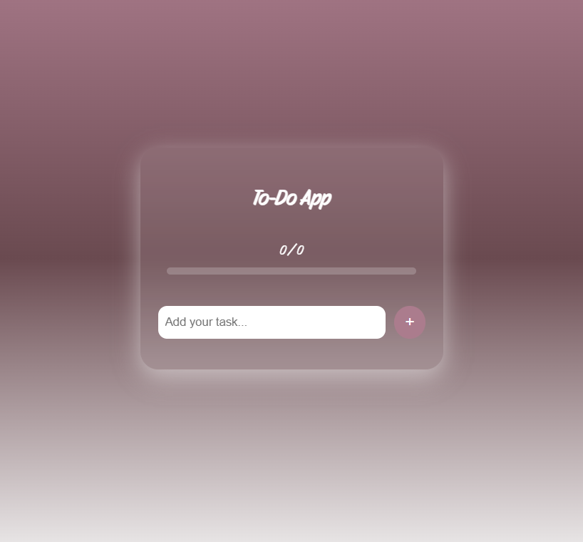
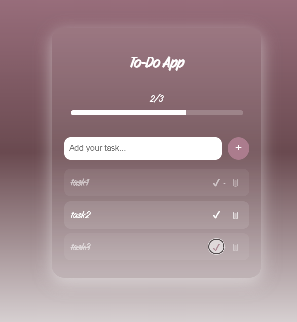
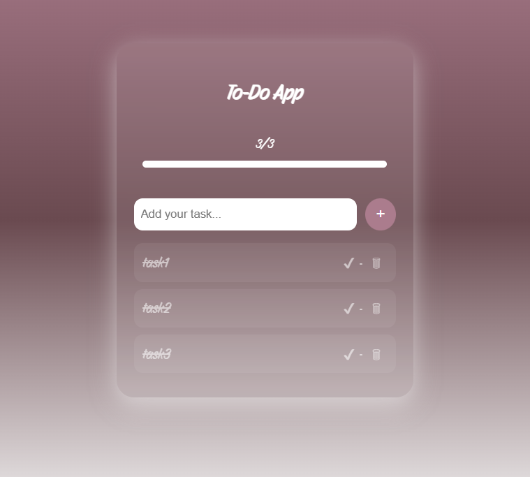

# To-Do List Project
This is an HTML + CSS + JS project for managing daily tasks.

## Website Interface

## How to Run?
Open `toDoList.html` in the browser.
* Make sure the images folder is in the same location as the files.
